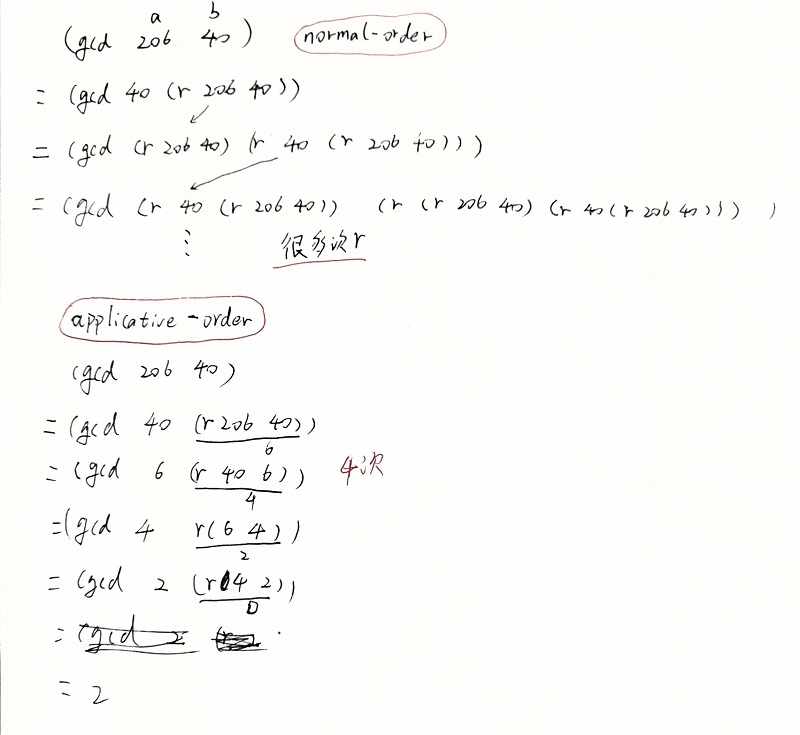

normal-order计算remainder的次数会很多，没有必要真的去一一写出来。applicative-order只计算4次。

normal-order全部替换（扩展）后再计算，，需要计算的时候再计算，又称lazy evaluation.

applicative-order evaluation 

自底向上，‘‘evaluate the arguments and then apply’’  ，interpreter 用的这种方式。applicative-order会计算所有的arguments,不管它会不会用到。